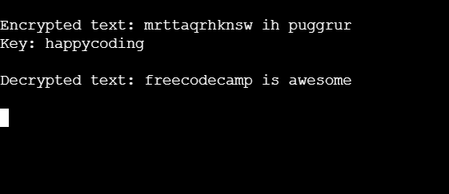

# **String Manipulation by Building a Cipher** (FreeCodeCamp)

Welcome to the **String Manipulation by Building a Cipher** project from **FreeCodeCamp**! This project demonstrates how to implement the **Vigenère Cipher** for encryption and decryption, helping you understand string manipulation and basic encryption techniques.

---

## 📝 **Project Overview**

This project allows you to:
- Implement the **Vigenère Cipher** to encode and decode messages.
- Work with string manipulation techniques in **Python**.
- Understand the process of encryption and decryption with a key.
- Build a reusable encryption tool.

This project is a part of **FreeCodeCamp's** curriculum and aims to teach you fundamental concepts of string manipulation and encryption.

---

## 📂 **Table of Contents**

1. [Installation](#installation)
2. [Usage](#usage)
3. [How It Works](#how-it-works)
4. [Technologies Used](#technologies-used)
5. [Output Screenshot](#output-screenshot)
6. [Contributing](#contributing)

---

## ⚙️ **Installation**

To run the **String Manipulation by Building a Cipher** project locally:

1. **Clone** the repository:
   ```bash
   git clone https://github.com/harshikab2112/String-Manipulation-by-Building-a-Cipher.git
   ```

2. **Navigate** to the project directory:
   ```bash
   cd String-Manipulation-by-Building-a-Cipher
   ```

3. (Optional) If you need to install dependencies using `pip`:
   ```bash
   pip install -r requirements.txt
   ```

4. **Open** the project in your favorite text editor or IDE.

---

## 🚀 **Usage**

This project provides a **Vigenère Cipher** that encrypts and decrypts messages based on a given key.

---

## 🔍 **How It Works**

1. **Vigenère Cipher**:
   - The `vigenere` function encrypts or decrypts a message by shifting each character based on the corresponding character in the key.
   
2. **Encryption**:
   - Each letter of the message is shifted according to the index of the key character.
   
3. **Decryption**:
   - The decryption process reverses the encryption by using a negative shift (using `direction = -1`).

4. **Non-Alphabetic Characters**:
   - Spaces, punctuation, and other non-alphabetic characters remain unchanged in both encryption and decryption.

---

## 🛠️ **Technologies Used**

- **Python** (for implementing the cipher algorithm)
- **String Manipulation** (looping through characters and modifying them based on ASCII values)

---

## 📸 **Output Screenshot**
-Here’s a screenshot of the output from the program:


---

## 🤝 **Contributing**

Contributions are welcome! If you would like to contribute, please follow these steps:

1. **Fork** the repository.
2. Create a **new branch**.
3. Implement your changes.
4. Create a **pull request** with a description of what you’ve changed.

---

### **Author**  
**Harshika Bansal**  
GitHub: [harshikab2112](https://github.com/harshikab2112)

---

### 🖤 **Thank You for Checking Out the Project!**

---
